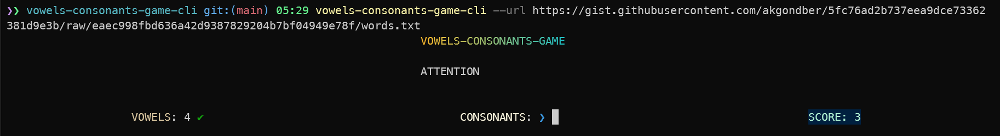

# vowels-consonants-game-cli [![NPM version][npm-image]][npm-url]

> This readme is automatically generated by [create-ink-app-custom](https://github.com/akgondber/create-ink-app-custom)

## Install

```bash
$ npm install --global vowels-consonants-game-cli
```

## CLI

```
$ vowels-consonants-game-cli --help

  Count vowels and consonants in the escaping word

  Usage
    $ vowels-consonants-game-cli

  Options
        --speed           Game speed (the lower the value, the more difficult the passage)
        --complicate      Add extra complication
        --url             Optional url source with words suite (when no provided default suite will be used)
        --no-show-banner  Whether to use banner at the top

  Examples
    $ vowels-consonants-game-cli --speed 4
    $ vowels-consonants-game-cli --no-show-banner
    $ vowels-consonants-game-cli --speed 3 --complicate
    $ vowels-consonants-game-cli --speed 3 --url https://gist.githubusercontent.com/akgondber/3a1da5cb02ba0f6f61f14cffd0ae93f2/raw/1835ade2290657acd3b544ea92d7eaf1aeabab9b/words.txt
```

## Demo


## Screenshots

Running round example using the following command:

```
vowels-consonants-game --url https://gist.githubusercontent.com/akgondber/5fc76ad2b737eea9dce73362381d9e3b/raw/eaec998fbd636a42d9387829204b7bf04949e78f/words.txt
```



## Suites

There is a possibility to use words suite from a url. To use this option provide `--url` or `--words-suite-url` argument with an appropriate http link as a source of suite.

Some available http sources:

- [`words-from-how-i-edited-an-agricultural-paper-by-m-twain`](https://gist.githubusercontent.com/akgondber/3e8f2064ddcf4c3b3379f1b1b5027b1f/raw/22975c42502c61e4b4077424552708dc59876d32/words.txt)
- [`words-from-the-spook-house-by-ambrose-bierce`](https://gist.githubusercontent.com/akgondber/3a1da5cb02ba0f6f61f14cffd0ae93f2/raw/1835ade2290657acd3b544ea92d7eaf1aeabab9b/words.txt)
- [`words-from-a-fable-by-m-twain`](https://gist.githubusercontent.com/akgondber/6f11f6adf882f5e1d6954abbf85b60c8/raw/5e9d071771634b1795b471bc4b1e3233e87fccb8/words.txt)
- [`words-from-a-comedy-in-rubber-by-o-henry`](https://gist.githubusercontent.com/akgondber/5fc76ad2b737eea9dce73362381d9e3b/raw/eaec998fbd636a42d9387829204b7bf04949e78f/words.txt)

You can create your own suites creating a gist (or any other hosting service you prefer), using any of the above links as an example.

## License

MIT © [Rushan Alyautdinov](https://github.com/akgondber)

[npm-image]: https://img.shields.io/npm/v/vowels-consonants-game-cli.svg?style=flat
[npm-url]: https://npmjs.org/package/vowels-consonants-game-cli
